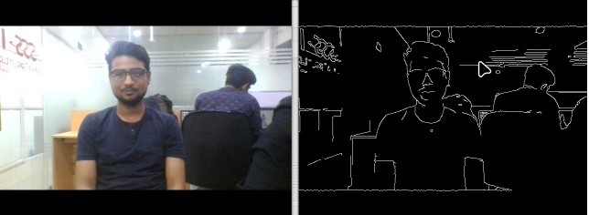

# Проект: Сетевой видеостриминг с выделением контуров

**Краткое описание:**  
Данный проект реализует сервер и клиент для передачи видеопотока с камеры с выделением контуров объектов (черно-белое изображение) по сети. Решение оптимизировано под низкий битрейт (0.1 Мбит/с), HD-разрешение и минимальную задержку, что подходит для онлайн-образования и других задач, требующих эффективной передачи видео.

---

## **Возможности**
- Передача видеопотока с камеры с выделением контуров объектов.
- Использование Python и OpenCV для обработки изображения.
- Простое масштабирование
- Кроссплатформенность 

---

## **Требования**
- Python 3.8+
- OpenCV


---

## **Установка**

```bash
uv sync 
source .venv/bin/activate.fish
```

---

## **Запуск**
- **Сервер:**
  ```bash
  python main.py server
  ```

- **Клиент:**
  ```bash
  python main.py client
  ```

---

## **Пример работы**





---

## **Примечания**
- Для корректной работы убедитесь, что камера подключена и доступна.
